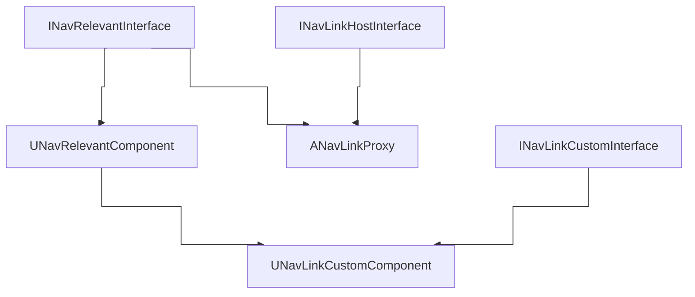

# Resources
- [Automatic Navigation Link Generation](https://dev.epicgames.com/documentation/en-us/unreal-engine/automatic-navigation-link-generation)
	- Image illustrating the nav links generation params![[Pasted image 20250819222719.png]]
- [About nav links (with jump example)](https://dev.epicgames.com/documentation/en-us/unreal-engine/overview-of-how-to-modify-the-navigation-mesh-in-unreal-engine#3-usingnavigationlinkproxies)
- [[Navigation Data]]

# Hierarchy
More can be found at [[Navigation Data]]

## Graph

## Types
### `ANavLinkProxy`
The `ANavLinkProxy` actor owns a `UNavLinkCustomComponent` and implements `INavLinkHostInterface` and `INavRelevantInterface`.

### `UNavLinkCustomComponent`
