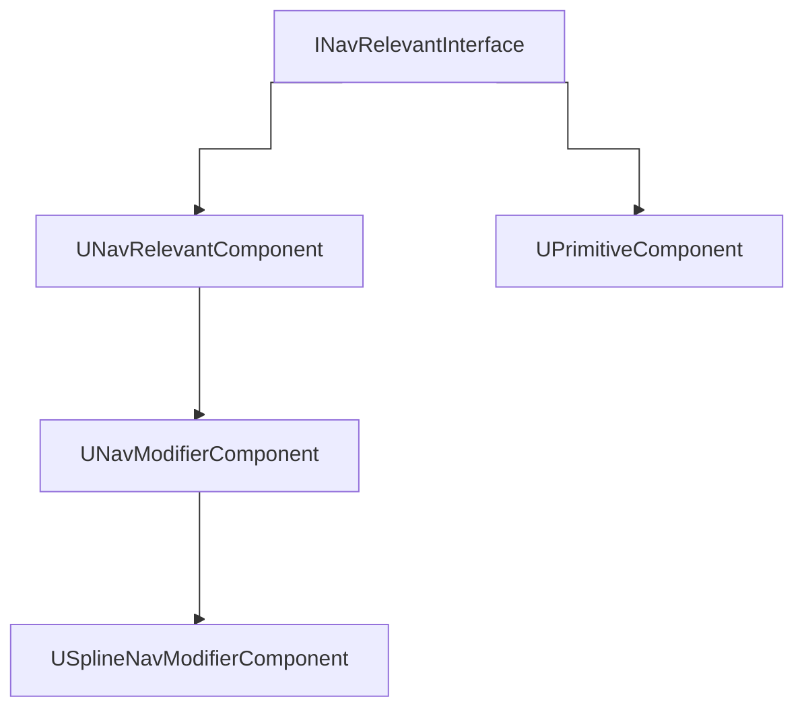

# Hierarchy
More can be found at [[Navigation Data]]

## Object Types

### Nav Modifier Component
It uses the bounds of all the primitive components owned by the owning actor (if they have collisions).

It implements the `INavRelevantInterface` interface, this is used in `UNavModifierComponent::GetNavigationData` to return the modifier volume `FAreaNavModifier`.
