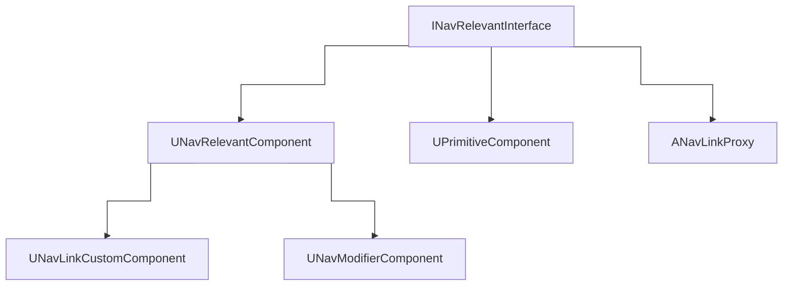
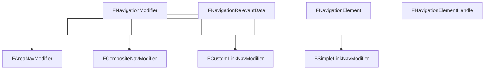

# About
The nav data seems to be built using the `INavRelevantInterface` interface with `GetNavigationData`.
For example `UPrimitiveComponent` implements it, as well as the parent of `UNavModifierComponent`, `UNavRelevantComponent`.

# Classes

## Global overview
### Objects & Interfaces

### Other types

## `FNavigationElement`
Structure registered in the navigation system that holds the required properties and delegates to gather navigation data (navigable geometry, NavArea modifiers, NavLinks, etc.) and be stored in the navigation octree. 
It represents a single element spatially located in a defined area in the level.
That element can be created to represent two use cases:  
1. Single UObject representing the navigation element constructed from a UObject raw or weak pointer  
2. Single UObject managing multiple non-UObject navigation elements constructed from a UObject raw or weak pointer and using the optional constructor parameter to identity a unique sub-element.

It has a `FNavigationDataExport NavigationDataExportDelegate` which is what runs `GetNavigationData` on actor components implementing `INavRelevantInterface`.

## `FNavigationElementHandle`
Structure used to identify a unique navigation element registered in the Navigation system.
The handle can be created to represent two use cases:  
1. Single UObject representing the navigation element constructed from a UObject raw or weak pointer  
2. Single UObject managing multiple non-UObject navigation elements constructed from a UObject raw or weak pointer and using the optional constructor parameter to identity a unique sub-element.

## `FNavigationRelevantData`
This holds a `FCompositeNavModifier` which holds an array of `Areas` (`FAreaNavModifier`), `SimpleLinks` (`FSimpleLinkNavModifier`), `CustomLinks` (`FCustomLinkNavModifier`) and some other less important parameters.

## Links
See [[Nav Links]]

## Modifiers
See [[Nav Modifiers]]
