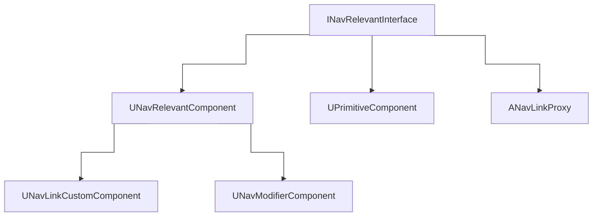
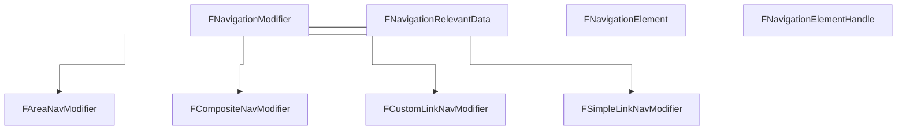

Also check [[Nav Mesh Registration & Generation]] and [[AI Navigation Types]].

# About
The nav data seems to be built using the `INavRelevantInterface` interface with `GetNavigationData`.
For example `UPrimitiveComponent` implements it, as well as the parent of `UNavModifierComponent`, `UNavRelevantComponent`.

# Classes

## Global overview
### Objects & Interfaces

### Other types

## Links
See [[Nav Links]]

## Modifiers
See [[Nav Modifiers]]
