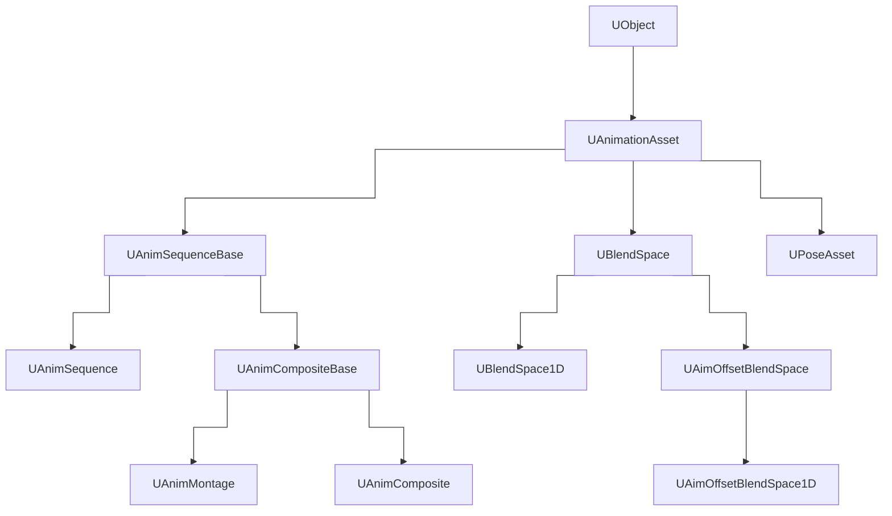

```mermaid
flowchart TD
%%{ init : {'flowchart': {'nodeSpacing': 100, 'rankSpacing': 100, "curve" : "step"}} }%%

    UObject
    UBlendSpace
    UBlendSpace1D
    UAnimSequenceBase
    UAnimSequence
    UAnimationAsset
    UAnimMontage
    UAnimCompositeBase
    UAnimComposite
    UAimOffsetBlendSpace
    UAimOffsetBlendSpace1D
    
    UObject --> UAnimationAsset
    UAnimationAsset --> UAnimSequenceBase
    UAnimationAsset --> UBlendSpace
    UBlendSpace --> UBlendSpace1D
    UAnimSequenceBase --> UAnimSequence
    UAnimCompositeBase --> UAnimMontage
    UAnimSequenceBase --> UAnimCompositeBase
    UAnimCompositeBase --> UAnimComposite
    UBlendSpace --> UAimOffsetBlendSpace
    UAimOffsetBlendSpace --> UAimOffsetBlendSpace1D
    UAnimationAsset --> UPoseAsset
```

