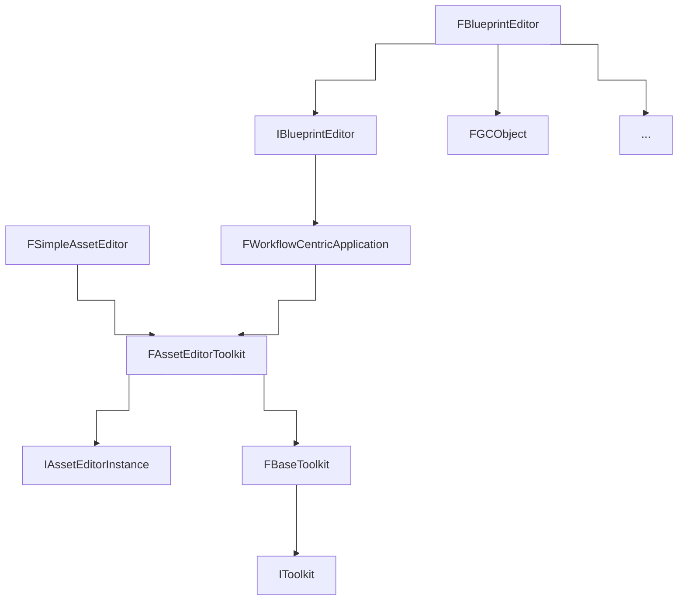

Mapping

```mermaid
flowchart TD
%%{ init : {'flowchart': {'nodeSpacing': 100, 'rankSpacing': 100, "curve" : "step"}} }%%

    FSimpleAssetEditor --> FAssetEditorToolkit
    FAssetEditorToolkit --> IAssetEditorInstance
    FAssetEditorToolkit --> FBaseToolkit
    FBaseToolkit --> IToolkit
    FBlueprintEditor --> IBlueprintEditor
    FBlueprintEditor --> FGCObject
    FBlueprintEditor --> ...
    IBlueprintEditor --> FWorkflowCentricApplication
    FWorkflowCentricApplication --> FAssetEditorToolkit
```

