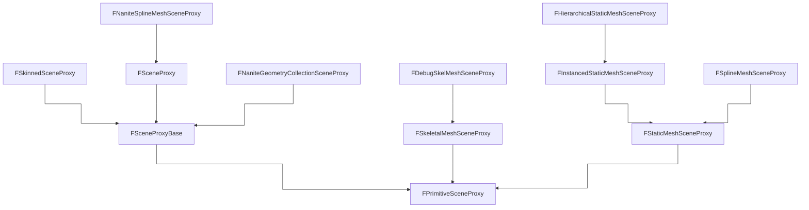

```mermaid
flowchart TD
%%{ init : {'flowchart': {'nodeSpacing': 100, 'rankSpacing': 100, "curve" : "step"}} }%%

    FSkinnedSceneProxy
    FSkeletalMeshSceneProxy
    FSceneProxyBase
    FPrimitiveSceneProxy
    FStaticMeshSceneProxy
    FInstancedStaticMeshSceneProxy
    FSplineMeshSceneProxy
    FHierarchicalStaticMeshSceneProxy
    FSceneProxy
    FNaniteGeometryCollectionSceneProxy
    FDebugSkelMeshSceneProxy
    
    
    FSkinnedSceneProxy --> FSceneProxyBase
    FSceneProxyBase --> FPrimitiveSceneProxy
    FSkeletalMeshSceneProxy --> FPrimitiveSceneProxy
    FInstancedStaticMeshSceneProxy --> FStaticMeshSceneProxy
    FStaticMeshSceneProxy --> FPrimitiveSceneProxy
    FSplineMeshSceneProxy --> FStaticMeshSceneProxy
    FHierarchicalStaticMeshSceneProxy --> FInstancedStaticMeshSceneProxy
    FSceneProxy --> FSceneProxyBase
    FNaniteGeometryCollectionSceneProxy --> FSceneProxyBase
    FNaniteSplineMeshSceneProxy --> FSceneProxy
    FDebugSkelMeshSceneProxy --> FSkeletalMeshSceneProxy
```
