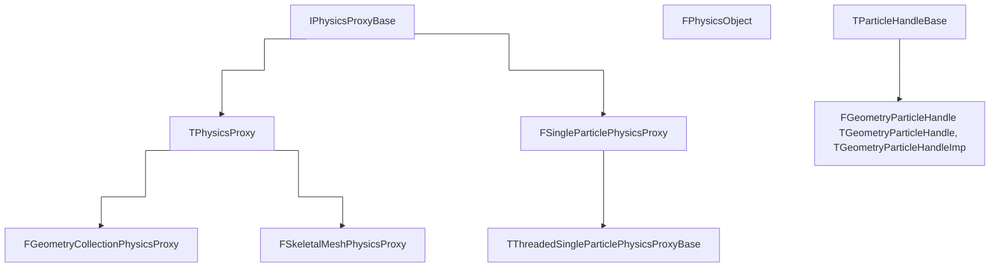

# Particles
## About
- `X` represents the location of the particle
- `R` represents the rotation of the particle.
- `V` represents the linear velocity of the particle
- `W` represents the angular velocity of the particle.
- `M` represents the mass of the particle.

## `FPhysicsActorHandle` (`FSingleParticlePhysicsProxy`)
Each Body Instance has a reference to a `FPhysicsActorHandle`. See [[Body Instance]].
From the `FSingleParticlePhysicsProxy` you can get its internal (`GetPhysicsThreadAPI`) and external (`GetGameThreadAPI`) rigid body handle.

It holds an `FParticleHandle`, alias of `FGeometryParticleHandle`.

## `FPhysicsObjectHandle` (`FPhysicsObject`)
The `FPhysicsObject` is effectively a reference to a single particle in the solver.  
It maintains this reference indirectly via the physics proxy. This object is meant to be usable on both the game thread and physics thread.

It holds a ref to `IPhysicsProxyBase* Proxy`, `int32 BodyIndex` and `FName BodyName`.
So for example you can have multiple `FPhysicsObject`s which has the same SKM proxy but have different body indexes and body names.

## `FGeometryParticleHandle` (`TGeometryParticleHandle`, `TGeometryParticleHandleImp`)

## `TParticleHandleBase`

## `IPhysicsProxyBase`

## `TPhysicsProxy`
Base object interface for solver objects. Defines the expected API for objects, uses CRTP for static dispatch, entire API considered "pure-virtual" and must be defined.  
Forgetting to implement any of the interface functions will give errors regarding recursion on all control paths for `TPhysicsProxy<T>` where T will be the type that has not correctly implemented the API.  

PersistentTask uses `IPhysicsProxyBase`, so when implementing a new specialized type it is necessary to include its header file in PersistentTask.cpp allowing the linker to properly resolve the new type. 

## `TThreadedSingleParticlePhysicsProxyBase`
Wrapper class that routes all reads and writes to the appropriate particle data. This is helpful for cases where we want to both write to a particle and a network buffer for example.

## `TThreadParticle` (`FGeometryParticle`, `FGeometryParticleHandle`)
It is an alias of `FGeometryParticle` if the thread is external or of type `FGeometryParticleHandle` if the thread is internal.

# Shapes

## `FShapeInstanceProxy`
`FShapeInstanceProxy` is a Game-Thread object.

It contains the per-shape data associated with a single shape on a particle.
This contains data like the collision / query filters, material properties etc.

Every particle holds one `FShapeInstanceProxy` object for each geometry they use.  
If the particle has a Union of geometries there will be one `FShapeInstanceProxy` for each geometry in the union. (Except ClusteredUnions - these are not flattened because they contain their own query acceleration structure.)

## `FShapeInstance`
`FShapeInstance` is a Physics-Thread object.

It contains the per-shape data associated with a single shape on a particle. This contains data like the collision / query filters, material properties etc.  

Every particle holds one `FShapeInstance` object for each geometry they use. If the particle has a Union of geometries there will be one `FShapeInstance` for each geometry in the union. (Except ClusteredUnions - these are not flattened because they contain their own query acceleration structure.)

## `FPerShapeData`
FPerShapeData is going to be deprecated. See FShapeInstance and FShapeInstanceProxy.
This is still used in engine as 5.6
