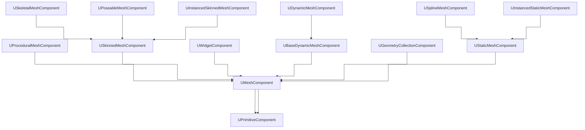

# About
It holds a `FBodyInstance BodyInstance` initialized in `UPrimitiveComponent::OnCreatePhysicsState`.
Most (all?) of their physic settings are in `BodyInstance` and `FBodyInstanceCore`.

Some special settings like the constraints are in `BodyInstanceCustomization.cpp` (`FBodyInstanceCustomizationHelper`).

For **Constraint** details check [[Body Instance]] and [[Constraints]]

# Classes
