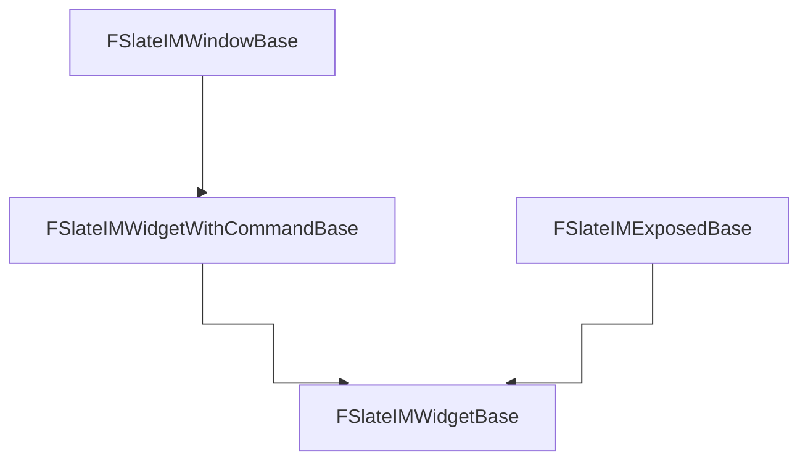

# About
SlateIM widgets/windows are meant to be constructed from commands. But you can also use SlateIM to build a SWidget and get it (see How it works section)

# Commands
- `SlateIM.ToggleSlateStyleBrowser`: A window showing the engine existing brushes, rich text, button styles, etc
- `SlateIM.ToggleTestSuiteWindow`: A ton of examples in a single window
- `SlateIM.ToggleTestSuiteViewport`: Same as above but the widget is "linked" to the viewport

# Examples
See the commands section and `FSlateIMTestWindowWidget` with `FSlateIMTestWidget`.

# How it works
*Arrows points to parent*

From this hierarchy we can understand the following:
- If you want a standalone window (which holds a widget) that is created from a command, use `FSlateIMWindowBase` or directly subclass `FSlateIMWidgetWithCommandBase`.
- If you want to use the SlateIM API and get the generated `SWidget` to use it elsewhere, use `FSlateIMExposedBase`.

For `FSlateIMWidgetBase`, the widget is constructed from the command that runs `FSlateIMWidgetWithCommandBase::ToggleWidget`. This will execute `FSlateIMWidgetBase::DrawWidget` on Slate PreTick until the window is disabled.
If conditions are met `FSlateIMWindowBase::DrawWindow` runs (which needs to be overridden, for example `FSlateIMTestWindowWidget` does it).

But for `FSlateIMExposedBase`, its different.
`FSlateIMExposedBase::DrawContent` is the functions that has to be overridden to build the widget.

**How to use `FSlateIMExposedBase` to embed it in other widgets?** 
Since after enabling the widget it needs at least 1 Slate PreTick to hold a valid `SWidget`, you have to enabled the widget BEFORE you use `GetExposedWidget`.
To avoid unnecessary calls, you also have to manually handle its active/inactive state depending on if the widget is displayed or not (since `DrawContent` is called regardless of its visibility).
